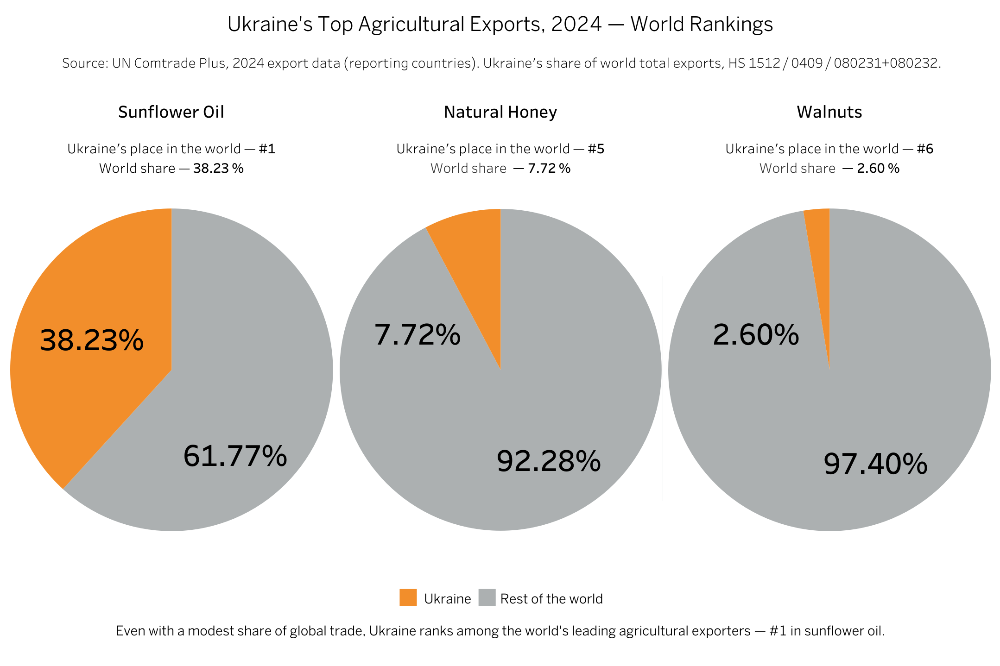
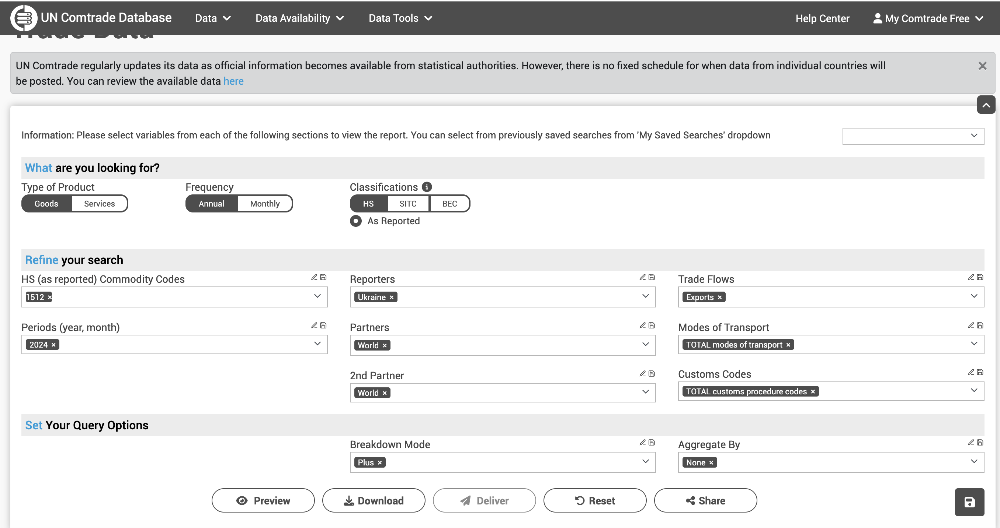

# Ukraine's Top Agricultural Exports, 2024 — World Rankings

A short data story built from UN Comtrade Plus trade statistics: in 2024, Ukraine was the world's **#1 exporter of sunflower oil**, **#5 exporter of natural honey**, and **#6 exporter of walnuts** — verified independently from primary trade data, not taken on faith from secondary sources.



**Live visualization:** [Tableau Public — Ukraine's Top Agricultural Exports, 2024 — World Rankings](https://public.tableau.com/app/profile/oleksandr.synichenko/viz/UkrainesTopAgriculturalExports2024WorldRankings/WorldRankings)

---

## The finding

Claims found on secondary sources (industry association reports, "top exporters" listicles) were re-derived from scratch: sum `primaryValue` (USD) across every reporting country in UN Comtrade for each product = world total; Ukraine's value ÷ world total = share; rank = Ukraine's position when all countries are sorted by export value.

| Product | HS Code | World Rank | World Share | Ukraine's Export Value |
|---|---|---|---|---|
| Sunflower / safflower / cottonseed oil | 1512 | **#1** of 105 | **38.23%** | $5,121,604,916 |
| Natural honey | 040900 | **#5** of 119 | **7.72%** | $166,952,056 |
| Walnuts, shelled | 080232 | #6 of ~85 | 3.46% | $82,683,581 |
| Walnuts, in shell | 080231 | #8 of ~85 | 0.77% | $8,637,092 |
| **Walnuts, combined** | 080231+080232 | **#6** of ~85 | **2.60%** | **$91,320,673** |

> **How to read these figures:** all ranks and shares are based on **export value in current USD**, not physical export volume, domestic production, or consumption. Unless explicitly stated otherwise, “world” refers to the economies that reported 2024 exports to UN Comtrade for the relevant HS code. The results should therefore be interpreted as rankings and shares within the available reporting dataset, rather than as a perfectly complete census of all global trade.

All three headline claims (#1 oil, #5 honey, #6 nuts) held up under independent recalculation. The original claims, as published, came from:

- [UCAB — Ukraine ranked 1st in the global sunflower oil export market in 2024](https://ucab.ua/en/ucab-survey-en/ukraine-ranked-1st-in-the-global-sunflower-oil-export-market-in-2024/)
- [UCAB — Ukraine took 5th place in the world honey export market in 2024](https://ucab.ua/ucab-survey/ukrayina-posila-5-miscze-na-svitovomu-rynku-eksportu-medu-v-2024-roczi/) (Ukrainian)
- [World's Top Exports — Top walnuts exporters by country](https://www.worldstopexports.com/top-walnuts-exporters-by-country/)

---

## Verifying Russia's competing export claim

UCAB's sunflower oil report also cited a competing figure for Russia's 2024 exports ($3.72B) without disclosing its underlying methodology. Since Russia does not report to UN Comtrade for this commodity, that number can't be checked directly against Comtrade — so an independent estimate was computed instead, using **mirror-trade data**: summing what Russia's trading *partners* themselves declared as **imports from Russia** (UN Comtrade, `Reporters=All`, `Flow=Imports`, `Partners=Russian Federation`) — this mirrors Russia's exports without relying on Russia's own (absent) statistics.

| | Export value | Ukraine's world share | Ukraine's rank |
|---|---|---|---|
| Comtrade reporters only (Russia absent) | — | 38.23% | #1 |
| **+ Russia, mirror-trade estimate** | **$4,445,892,142** | **28.71%** | **#1** (lead: $675.7M) |

Top buyers behind that mirror-trade total: India ($1.96B), Türkiye ($758M), China ($654M), Egypt ($464M), Uzbekistan ($107M). The independently computed estimate ($4.45B) lands in the same range as UCAB's uncited figure ($3.72B) — rough corroboration, though the two aren't expected to match exactly since UCAB's methodology is unknown.

**Caveat:** Ukraine's figure is **FOB** (value at seller's border); the mirror-trade figure for Russia is necessarily **CIF** (value at buyer's border, including freight and insurance) — CIF is always ≥ FOB for the same physical shipment. This means the comparison above is conservative in Russia's favor: Russia's true FOB export value is likely lower than $4.45B, so Ukraine's real lead is probably larger than $675.7M, not smaller.

**Ukraine remains the world's #1 sunflower oil exporter even after adding Russia's estimated volume.**

---

## Data

- **Source:** [UN Comtrade Plus](https://comtradeplus.un.org/) — international merchandise trade statistics.
- **Period:** 2024, annual.
- **Commodities (HS codes):** 1512 (sunflower/safflower/cottonseed oil), 040900 (natural honey), 080231 (walnuts, in shell), 080232 (walnuts, shelled).
- **Value field:** `primaryValue` — FOB for exports (`flowCode="X"`), CIF for imports (`flowCode="M"`).
- **Files** (`data/`):
  - `world_export_2024_<product>.xlsx` — one row per reporting country (`Reporters=All`, `Partners=World`, `Flow=Exports`).
  - `ukraine_export_2024_<product>.xlsx` — single aggregated row for Ukraine (`Reporters=Ukraine`, `Partners=World`, `Flow=Exports`) — used to cross-check the value pulled from the world file.
  - `world_import_from_rf_2024_sunflower_oil_1512.xlsx` — mirror-trade data (`Reporters=All`, `Partners=Russian Federation`, `Flow=Imports`).
  - `ukraine_agri_exports_2024_summary.csv` — final consolidated output table.

**Example query filter** (comtradeplus.un.org), Ukraine-only sunflower oil cross-check:




---

## Reproduce

**1. Load the data** (R + [`readxl`](https://readxl.tidyverse.org/)):

```r
library(readxl)

ue_sno_1512        <- read_excel("data/ukraine_export_2024_sunflower_oil_1512.xlsx")
ue_nh_040900        <- read_excel("data/ukraine_export_2024_natural_honey_040900.xlsx")
wwe_sno_1512        <- read_excel("data/world_export_2024_sunflower_oil_1512.xlsx")
wwe_nh_040900       <- read_excel("data/world_export_2024_natural_honey_040900.xlsx")
wwe_wln_ins_080231  <- read_excel("data/world_export_2024_walnuts_inshell_080231.xlsx")
wwe_wln_sd_080232   <- read_excel("data/world_export_2024_walnuts_shelled_080232.xlsx")
wwe_sno_from_rf_1512 <- read_excel("data/world_import_from_rf_2024_sunflower_oil_1512.xlsx")
```

**2. Compute world share and rank for any country:**

```r
world_share <- function(df, iso = "UKR") {
  df$primaryValue <- as.numeric(df$primaryValue)
  stopifnot(sum(duplicated(df$reporterISO)) == 0)
  world_total <- sum(df$primaryValue, na.rm = TRUE)
  value       <- sum(df$primaryValue[df$reporterISO == iso], na.rm = TRUE)
  ord  <- df[order(-df$primaryValue), ]
  rank <- which(ord$reporterISO == iso)
  list(world_total = world_total, value = value,
       share_pct = round(value / world_total * 100, 2), rank = rank)
}

world_share(wwe_sno_1512)             # Ukraine, sunflower oil
```

**3. Combine walnut sub-categories:**

```r
combined_wlnts <- rbind(wwe_wln_sd_080232[, c("reporterISO", "primaryValue")],
                         wwe_wln_ins_080231[, c("reporterISO", "primaryValue")])
combined_wlnts$primaryValue <- as.numeric(combined_wlnts$primaryValue)
combined_wlnts_sum <- aggregate(primaryValue ~ reporterISO, data = combined_wlnts, sum)
world_share(combined_wlnts_sum)
```

**4. Add Russia's mirror-trade estimate and compare countries directly:**

```r
russia_value <- sum(wwe_sno_from_rf_1512$primaryValue, na.rm = TRUE)

wwe_sno_1512_with_rf <- rbind(
  wwe_sno_1512[, c("reporterISO", "primaryValue")],
  data.frame(reporterISO = "RUS", primaryValue = russia_value)
)

world_share(wwe_sno_1512_with_rf)               # Ukraine, incl. Russia
world_share(wwe_sno_1512_with_rf, iso = "RUS")  # Russia
```

Full script: [`scripts/ukraine_world_share.R`](scripts/ukraine_world_share.R).

---

## Methodological notes (read before quoting the numbers)

1. UN Comtrade's default "world total" sums only **reporting** economies. Russia reports for none of these four commodities, and other non-reporting economies may also be absent. The headline table and dashboard use the reporting-country denominator; the Russia mirror-trade scenario is a separate sensitivity check and is not included in the reported 38.23% sunflower-oil share.
2. Accordingly, “world rank” means rank among the economies present in the relevant UN Comtrade export dataset. It should not be read as proof that every economy in the world submitted complete data for the product and year.
3. HS 1512 covers sunflower, safflower, **and** cottonseed oil combined, not sunflower oil alone. “Sunflower oil” is used as a concise display label because it is the commercially relevant component for Ukraine, but readers should keep the full HS-code scope in mind when interpreting the world total and cross-country comparison.
4. The Russia mirror-trade figure is an analytical estimate, not an official Russian export declaration. Mirror data can be affected by reporting coverage, timing differences, partner attribution, re-exports, and later revisions.
5. FOB (export valuation) and CIF (import valuation) are not directly comparable. The Ukraine figure is reported on an FOB basis, while the Russia mirror estimate is derived from partner imports recorded on a CIF basis; the comparison should therefore be treated as a robustness check rather than a like-for-like valuation.
6. Rankings are based on **trade value**, not tonnes. A country's position by physical export volume may differ because of product mix, quality, unit prices, exchange rates, and other valuation effects.
7. The combined walnut result was calculated by first summing HS 080231 and HS 080232 export values for each reporting economy and only then recalculating the ranking. The individual category ranks themselves were not added or averaged.
8. The shares describe merchandise exports, not Ukraine's share of world production, supply, consumption, or food availability.
9. Figures reflect UN Comtrade Plus data as downloaded; Comtrade may revise historical records, so later downloads can produce slightly different results.

---

## Repository structure

```
.
├── README.md
├── dashboard_screenshot.png                                # hero of my story
├── comtrade_query_example.png                              # example query filter
├── data/
│   ├── world_export_2024_sunflower_oil_1512.xlsx
│   ├── world_export_2024_natural_honey_040900.xlsx
│   ├── world_export_2024_walnuts_inshell_080231.xlsx
│   ├── world_export_2024_walnuts_shelled_080232.xlsx
│   ├── world_import_from_rf_2024_sunflower_oil_1512.xlsx   # mirror-trade data for sunflower
│   ├── ukraine_export_2024_sunflower_oil_1512.xlsx
│   ├── ukraine_export_2024_natural_honey_040900.xlsx
│   ├── ukraine_export_2024_walnuts_inshell_080231.xlsx
│   ├── ukraine_export_2024_walnuts_shelled_080232.xlsx
│   └── ukraine_agri_exports_2024_summary.csv               # final output table
└── scripts/
    └── ukraine_world_share.R                               # full analysis script in R
```

---

## Tech stack

`R` (base R, `readxl`) · UN Comtrade Plus (source data) · Tableau Public (visualization)

## License

This repository mixes original work and third-party data under **two different licenses**:

- **Code** (script, README, generated summary table) — [MIT License](LICENSE) © 2026 Oleksandr Synichenko.
- **Data** — sourced from [UN Comtrade Plus](https://comtradeplus.un.org/). Per UN Comtrade's [terms of use](https://uncomtrade.org/docs/faqs-on-use-and-re-dissemination/), data that has been transformed (new indicators, statistical estimation, aggregation) is not subject to the original copyright restrictions; the figures in this repository (world shares, ranks, mirror-trade estimates) are such transformed outputs. Raw per-product export files are included for reproducibility.

This project is an independent analysis. The United Nations does **not** endorse and is **not** affiliated with this repository, its author, or any content, output, or analysis resulting from or related to `comtradeplus.un.org`.

## Author

Oleksandr Synichenko — [Tableau Public](https://public.tableau.com/app/profile/oleksandr.synichenko)
